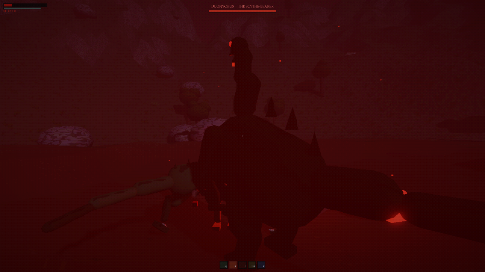

# METAZOIC

A PS2-style, third-person, open-world action game built in **Godot 4**.



> A meteorite breaks apart in the atmosphere and seeds Earth with a venom-like parasite.
> It grants powers to a lone caveman — and to a handful of apex dinosaurs. Hunt the
> infected boss dinosaurs, defeat them, and **absorb their powers**: the Triceratops' shield,
> the Tyrannosaurus' jaws, the Velociraptor's claws, and more.

See the full concept in **[GAME_DESIGN.md](GAME_DESIGN.md)**.

## Tech stack

| Piece   | Choice        | Why |
|---------|---------------|-----|
| Engine  | **Godot 4.4** | Everything is human-readable text (`.tscn`/`.tres`/`.gd`) — ideal for AI-assisted development and clean git diffs. Great for low-poly/PS2 looks. |
| Language| **GDScript**  | Simple, Python-like, no separate toolchain needed. |
| Hosting | **GitHub**    | `github.com/nicolaspazos/METAZOIC` |

## Getting started

### 1. Install the Godot 4 editor

You need the **standard** (not .NET/Mono) build of Godot 4.4+.

- Download: https://godotengine.org/download/windows/ — grab **Godot Engine 4.x (Standard)**.
- Or run the helper script from the repo root in PowerShell:
  ```powershell
  ./tools/install-godot.ps1
  ```
  It downloads Godot into `tools/godot/` (git-ignored) and prints the path to the `.exe`.

### 2. Open the project

Launch Godot, click **Import**, and select the `project.godot` file in this folder.
(First open takes a few seconds while Godot imports assets into `.godot/`.)

### 3. Play

Press **F5** (or the ▶ button). You control the caveman:

| Input        | Action                    |
|--------------|---------------------------|
| **W A S D**  | Move (camera-relative)    |
| **Mouse**    | Orbit camera              |
| **Space**    | Jump                      |
| **LMB**      | Parasite-fist combo (unlocked by the meteor) |
| **LMB during recovery** | Buffer the next combo strike |
| **Q** (hold) | Ceratops Shield — blocks frontal damage |
| **E**        | Duonychus Claws — shredding dash |
| **F**        | Tyrant Jaws — devouring bite (executes weakened prey) |
| **RMB**      | Heavy two-hand slam (slow, 32 dmg, shockwave) |
| **Ctrl**     | Dodge — quick burst with i-frames |
| **Shift**    | Pachy Charge — ram that sends enemies flying |
| **R**        | Ankylo Tail — 360° sweep |
| **P**        | *(debug)* unlock all powers |
| **Esc**      | Free / recapture the mouse |

Jump inputs are buffered briefly and low ledges can be mantled automatically while
moving into them. Heavy attacks, dodges, and dash mutations spend the stamina bar
beneath health; basic movement and light attacks always remain available.

**How it starts:** you wake at your camp, hair over your eyes, unarmed — the
wildlife ignores you. Follow the objective to the fallen meteor. Touching the
black-red shard **bonds the parasite to you**: your hair parts, black-red
**parasite fists** grow over your hands, and every raptor in the valley starts
hunting you. Powers unlock by killing the dinosaur that carries them — start
with **Duonychus**, a scythe-clawed therizinosaur guarding the crater (grants
Duonychus Claws). At half health it enters a faster parasite-frenzy phase.

## Regenerating assets

All textures and audio are procedurally generated — no binary sources to lose:

```powershell
godot --headless --path . -s tools/asset_gen/generate_textures.gd
godot --headless --path . -s tools/asset_gen/generate_audio.gd
```

## Project layout

```
METAZOIC/
├─ project.godot          # Engine + project config (text)
├─ scenes/
│  ├─ main.tscn           # The world — entry point (ground, lights, rocks, player)
│  └─ player/player.tscn  # The caveman: body, camera rig
├─ scripts/
│  ├─ player/player.gd    # Third-person movement + camera
│  ├─ systems/power_system.gd  # Autoload: absorbed-power registry
│  └─ enemies/boss_dinosaur.gd # Base class for power-granting bosses
├─ assets/                # models / textures / audio / materials
├─ docs/                  # Extra design & technical notes
└─ tools/                 # Dev helpers (Godot installer, etc.)
```

## Contributing / working with AI

This repo is structured to be edited by AI agents. Read **[CLAUDE.md](CLAUDE.md)** first —
it documents conventions, how scenes/scripts fit together, and how to add new content.
